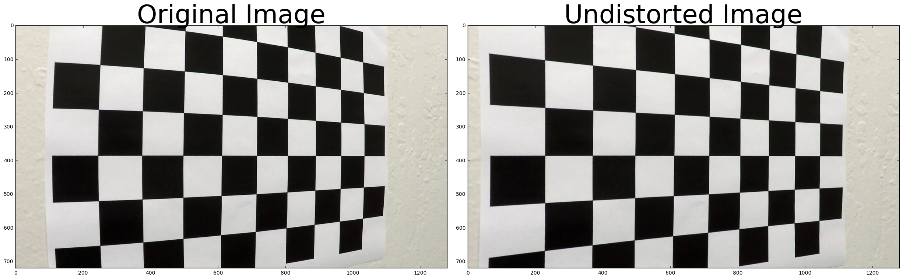
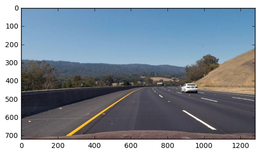
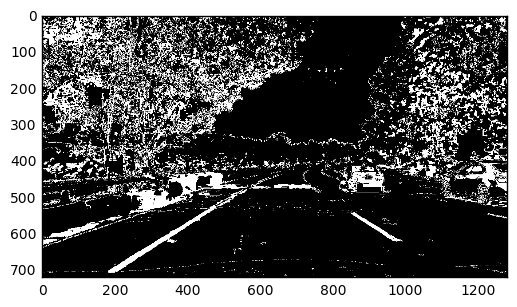
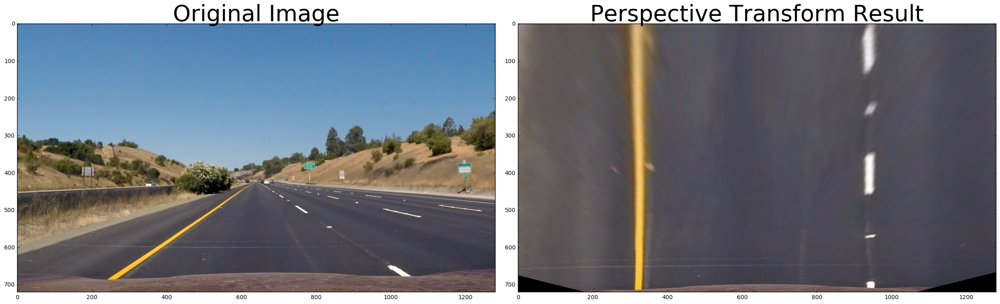
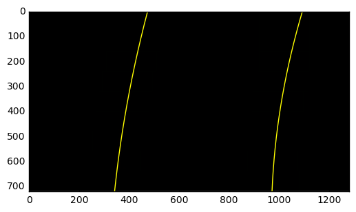
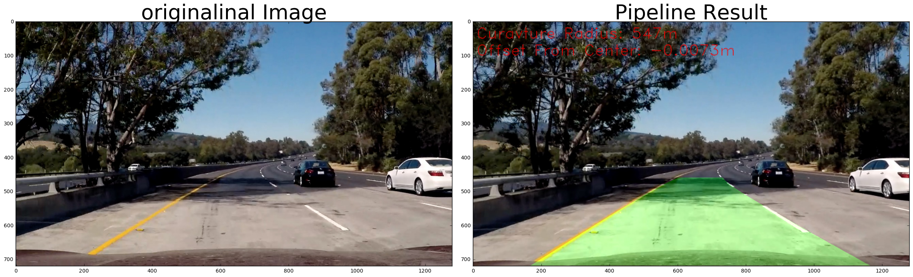

## Advanced Lane Finding
---
The goals / steps of this project are the following:

* Compute the camera calibration matrix and distortion coefficients given a set of chessboard images.
* Apply a distortion correction to raw images.
* Use color transforms, gradients, etc., to create a thresholded binary image.
* Apply a perspective transform to rectify binary image ("birds-eye view").
* Detect lane pixels and fit to find the lane boundary.
* Determine the curvature of the lane and vehicle position with respect to center.
* Warp the detected lane boundaries back onto the original image.
* Output visual display of the lane boundaries and numerical estimation of lane curvature and vehicle position.

## Project Report:
---
Code for this project is provided in submitted python notebook.

##Camera Calibration:
* Points for the object and image are saved in the pickle file, which is then referenced by the
undistort function in Cell4. 
* Image points are obtained from the calibration images
provided.   `cv2.findChessboardCorners`   method is used to obtain image points.
* `cv2.calibrateCamera`   method is used to get camera matrix and distortion coeficient.
* `cv2.undistort`   method is used to get the undistorted image.

---

Below is the example of distortion corrected image :

##Color Transform and gradients:
For last submssion I have used combination of threshold in x,y(20-100), maginute(30-100),
direction(0.7-1.3) for gray image and for s channel of hsv image(120-255). Please look at the Cell
6. Not resulted into optimum solution, but good enough to get the correct output.
I have added R threshold and combined S X-dir threshold to S(HSV). Results are far better.

##Perspective transform:

I have created Class Pers_Trans, with warp and unwarp functions. To get the transform matrix I
choose the source and destination points explained in the writup template. Did the trial and error to
get the better result. Please look at the Cell 5. Following is the output image after transformation.

---
I have used window slide method to get the left and right pints on the images. For that I have
used same histogram and convolution method to get the pixels within the window. 9 windows with
the height of 80 are used to get the result on image of size 720. Initial points are resulted from
histogram method. Please look at Cell 7.

##Radius of curvature:

rad_curvature function used in the Cell 8 explained the methhod used to get radius of
curvature.Radius is smoothed using weighted average over the last frame. Ployfit method of numpy
is used to get the updated polynomial(scaled for real word measurments ie. Converted from the
pixel to meters).

---
As explained in the Cell 9, lines are plotted on the image, unwarped it and overlayed with
the original image. Radius of curvature and offset are plotted as shown in the Cell 11.

---
Likely failure of the code.
I think I have to iterate more with the color thresholds. Right now its not optimum (as you can
observe in the example image)and give bad results with the different type of the enviornmental
conditions.

